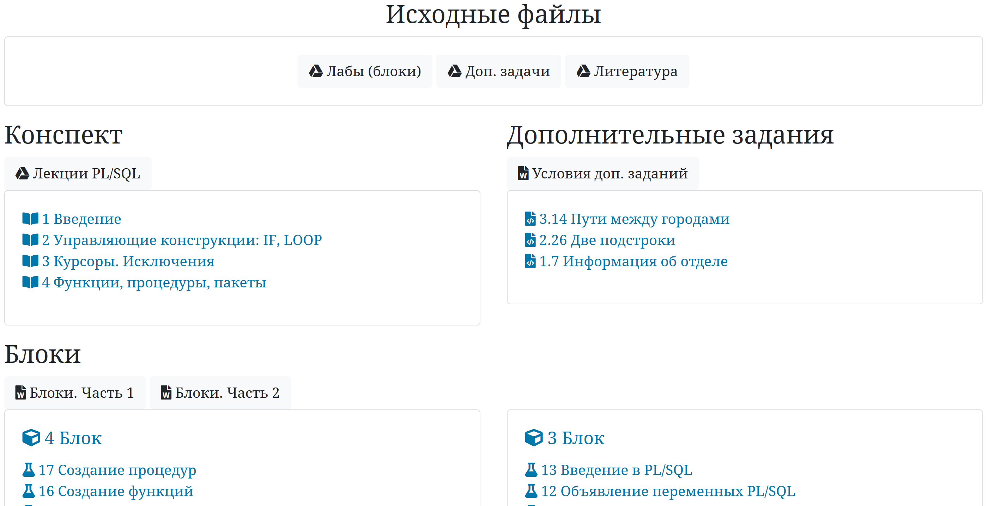

# Администрирование баз данных. PL/SQL

### О репозитории

Данный репозиторий представляет собой сборник лекционных и практических материалов по курсу «Администрирование баз данных (Oracle)». Здесь так же находятся решения к блокам и доп. задачам.

Автор — Влад Фурман.

Все материалы находятся [здесь](https://ruminat.github.io/PL-SQL-labs/).

